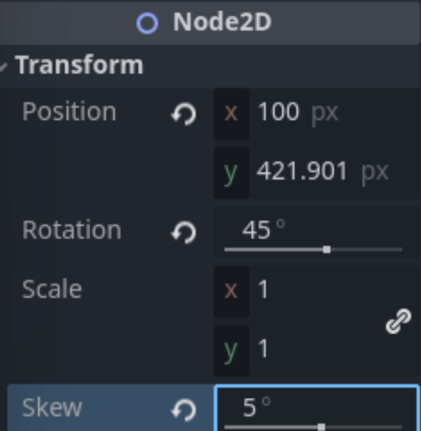

1. Apa saja pesan log yang dicetak pada panel Output? 
Jawaban: Pesan log yang tercetak adalah "Platform initialized" dan "Reached Objective!"

2. Coba gerakkan landasan ke batas area bawah, lalu gerakkan kembali ke atas hingga hampir menyentuh batas atas. Apa saja pesan log yang dicetak pada panel Output? 
Jawaban: Pesan log yang tercetak masih "Reached Objective!"

3. Buka scene MainLevel dengan tampilan workspace 2D. Apakah lokasi scene ObjectiveArea memiliki kaitan dengan pesan log yang dicetak pada panel Output pada percobaan sebelumnya? 
Jawaban: ObjectiveArea terletak di bagian atas viewport, di area dekat batas atas yang disentuh oleh BlueShip. Artinya, pesan log tersebut tercatat ketika BlueShip menyentuh ObjectiveArea.

4. Scene BlueShip dan StonePlatform sama-sama memiliki sebuah child node bertipe Sprite. Apa fungsi dari node bertipe Sprite? 
Jawaban: Scene BlueShip dan StonePlatform sama-sama memiliki "tampilan" karena mereka sama-sama bertipe Sprite2D. Node-node dengan tipe tersebut dapat menampilkan 2D texture. Intinya, node sprite menampilkan texture, sehingga kita dapat mengatur tampilan objek sesuai keinginan.

5. Root node dari scene BlueShip dan StonePlatform menggunakan tipe yang berbeda. BlueShip menggunakan tipe RigidBody2D, sedangkan StonePlatform menggunakan tipe StaticBody2D. Apa perbedaan dari masing-masing tipe node? 
Jawaban: StaticBody2D tidak dapat digerakkan oleh gaya eksternal (misalnya, ditabrak objek lain). StaticBody2D hanya dapat digerakkan dengan manual. RigidBody2D dapat digerakkan dengan gaya eksternal, sehingga kita dapat menggunakan StonePlatform yang bertipe StaticBody2D untuk menggerakkan BlueShip bertipe RigidBody2D dengan mendorongnya. BlueShip juga akan jatuh tanpa platform yang menyokongnya karena terpengaruh gaya gravitasi.

6. Ubah nilai atribut Mass pada tipe RigidBody2D secara bebas di scene BlueShip, lalu coba jalankan scene MainLevel. Apa yang terjadi? 
Jawaban: Mengubah nilai atribut mass sepertinya tidak mengubah apapun pada scene tersebut.

7. Ubah nilai atribut Disabled pada tipe CollisionShape2D di scene StonePlatform, lalu coba jalankan scene MainLevel. Apa yang terjadi? 
Jawaban: Setelah CollisionShape2D dari StonePlatform di-disable, BlueShip tidak bisa collide dengan StonePlatform, sehingga jatuh. StonePlatform masih bisa digerakkan dengan manual, tetapi tidak bisa digunakan untuk menggerakkan BlueShip lagi.

8. Pada scene MainLevel, coba manipulasi atribut Position, Rotation, dan Scale milik node BlueShip secara bebas. Apa yang terjadi pada visualisasi BlueShip di Viewport?
Jawaban: BlueShip di ViewPort berubah sesuai atributnya yang baru diubah. 

9. Pada scene MainLevel, perhatikan nilai atribut Position node PlatformBlue, StonePlatform, dan StonePlatform2. Mengapa nilai Position node StonePlatform dan StonePlatform2 tidak sesuai dengan posisinya di dalam scene (menurut Inspector) namun visualisasinya berada di posisi yang tepat? 
Jawaban: PlatformBlue memiliki titik koordinat (35, 565) karena anchornya terletak di koordinat tersebut terhadap parent nodenya, dan titik koordinat tersebut sesuai dengan yang di visualisasi. StonePlatform memiliki titik koordinat (0,0) di atribut Position karena anchornya tepat di anchor PlatformBlue, sehingga terletak pas di origin. StonePlatform2 memiliki koordinat (70, 0) di atribut Position karena di ketinggian yang sama dengan anchor PlatformBlue, tetapi 70 pixel lebih ke kanan. Intinya, atribut Position relatif terhadap parentnya, jadi nilainya tampak tidak sesuai untuk StonePlatform dan StonePlatform2.
